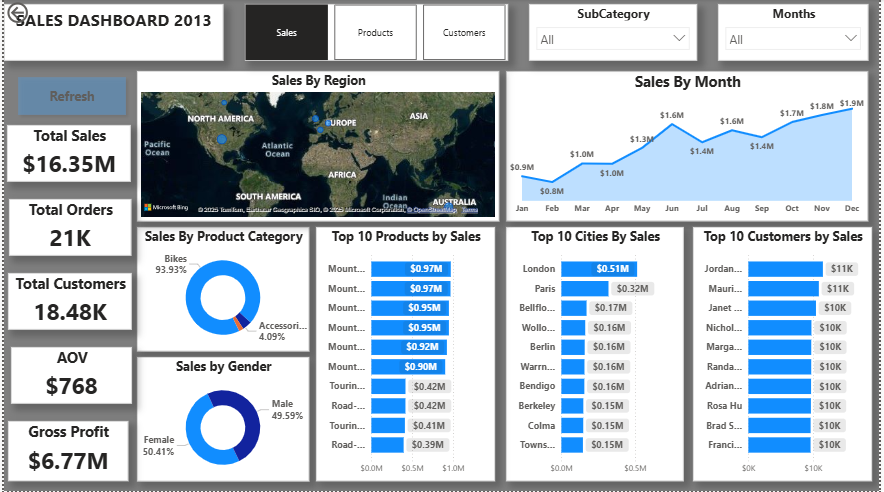
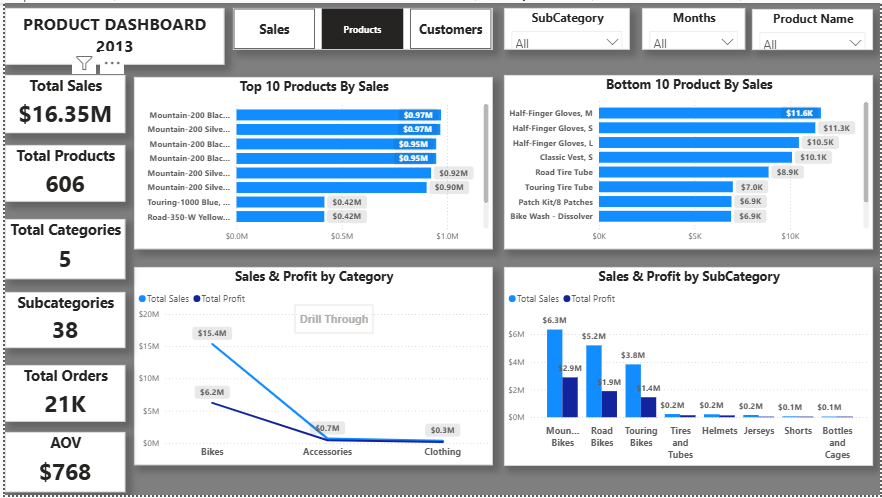
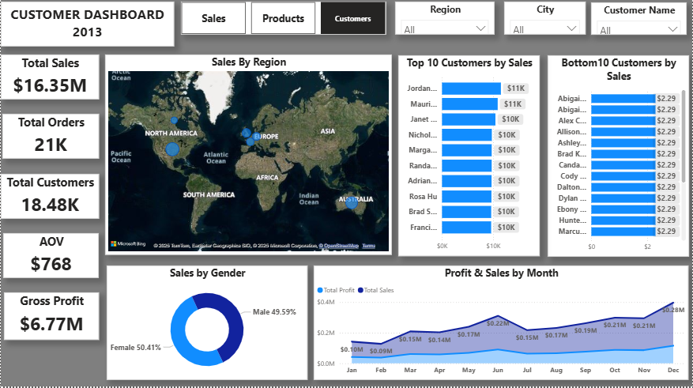

# AdventureWorks-Sales-Dashboard-

## 📌 Objective  
To build an interactive Power BI dashboard using AdventureWorksDW2022 data warehouse to analyze sales, orders, and customers Using SQL.

## 📊 Dataset  
- AdventureWorksDW2022 (sample database from Microsoft).  
- Dimension tables: Customers, Date, Products, Product Category.
- fact Table: Sales

## 🛠️ Tools Used  
- SQL Server Management Studio (SSMS) for queries  
- Power BI for dashboard visualization

## 🔎 Approach  
1. Wrote SQL queries to extract and join sales/customer/product/Product Category data.  
2. Cleaned data using SQL (handling NULLs, duplicates, Format).  
3. Imported SQL results into Power BI through Direct Query.  
4. Built interactive dashboard with KPIs (Total Sales, Orders, Customers, Average Order Value, Gross Profit).

## 💡 Key Insights  
- Top 10 customers contributed ~40% of sales.
- Gross Profit was ~41.41% of Total Sales.
- Bikes were the highest-selling product category.  
- Seasonal spikes in sales during the month of June.
- London & Paris were top cities in sales.
- sales by Gender were almost equal.
- Mountain, Road & touring bikes were the most seeling profuct in Subcategory.

  ## Dashboard Preview

### SQL-Sales

### SQL-Products

### SQL-Customer

